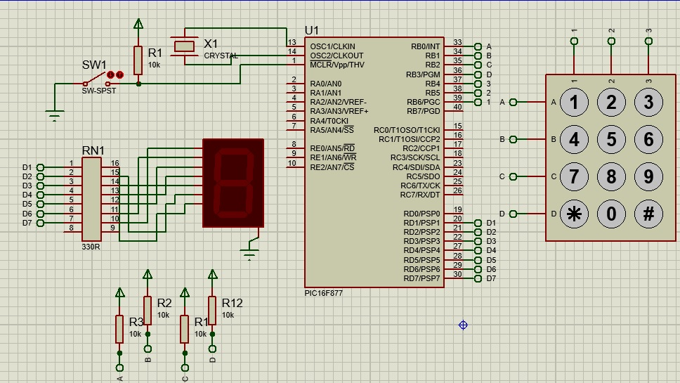

# Leitura-de-Teclado-por-Varredura
Esta interface de entrada e largamente utilizada em sistemas eletrônicos, este circuito e constituído por 
um microcontrolador um display de 7 seguimentos e um teclado numérico padrão telefônico, o display apresentara ao 
operador o símbolo correspondente à tecla pressionada, as linhas do teclado são ligadas por resistores de pull-up.

